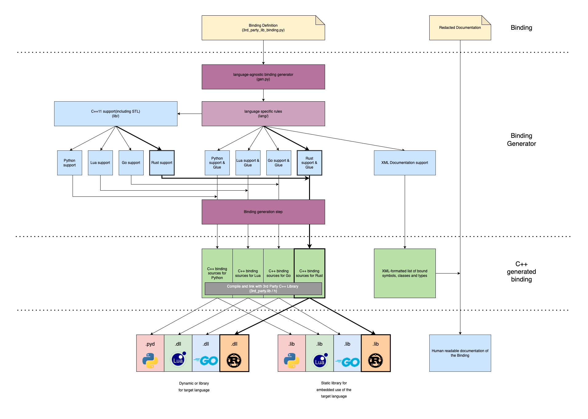

<hr>
<p  align="center"  style="font-weight: bold; font-size: 21px"> ALGOSUP Binding Project </p>

<p  align="center"  style="font-weight: bold; font-size: 18px"> Technical Specification</p>

<br>

<p  align="center"> Clémentine Curel</p>  
<br>
<p style="font-weight: bold;" align=center> Team:</p>  
<p align="center"> Victor Leroy, Théo Diancourt, Paul Maris, Malo AArchimbaud</p>  

<br>

<p  align="center"> ALGOSUP, Group 5. All Rights Reserved. </p>

<hr>

# Summary

<details>

<summary>Table of content</summary>

- [Summary](#summary)
- [Introduction](#introduction)
	- [Overview](#overview)
	- [Context](#context)
	- [Technical requirements](#technical-requirements)
	- [Non-goals](#non-goals)
	- [Assumptions](#assumptions)
- [Solution](#solution)
	- [Current solution](#current-solution)
	- [Proposed solution](#proposed-solution)
    - [New FABGen architecture](#new-fabgen-architecture)
	- [Test plan](#test-plan)
- [Functions to implement](#functions-to-implement)
    - [rust.py](#rustpy)
    - [__ init __.py](#__-init-__py)
    - [std.py](#stdpy)
    - [stl.py](#stlpy)
- [Further considerations](#further-considerations)
    - [Impact on other teams](#impact-on-other-teams)
    - [Cost analysis](#cost-analysis)
    - [Security](#security)
    - [Privacy](#privacy)
    - [Accessibility](#accessibility)
    - [Risks](#risks)
- [Success evaluation](#success-evaluation)
- [Work estimate](#work-estimate)
    - [Code convention](#code-convention)
    - [Convert types](#convert-types)
    - [Convert keywords](#convert-keywords)
    - [Manage polymorphism](#manage-polymorphism)
- [Deliberation](#deliberation)
    - [Discussion](#discussion)
    - [Open questions](#open-questions)
- [End matter](#end-matter)
    - [References](#references)
    - [Acknowledgements](#acknowledgements)
- [Footnotes](#footnotes)

</details>

<br>


# Introduction

## Overview

The ALGOSUP binding is a project asked by the company Harfang3D[^harfang].

This project aims to improve the FABGen[^fabgen] tool by adding the Rust bindings[^binding].
In simple words, it will be a translation of your code to another language.

This project started on the 3rd of January, 2023 and is due on the 17th of February, 2023.

## Context


FABGen[^fabgen] was written for the Harfang 3D[^harfang] project to bring the C++ engine to languages such as Python, Lua and Go. It was written as a replacement for SWIG[^swig], a well-known binding generator[^gene] supporting many target languages.

The goals of FABGen are: 

- Bidirectional binding. Bind C++ functions to the target language and target language functions to C++.

- Provide an API for embedding (runtime C type name to target name query, human-readable type conversion functions, etc.).

- Full feature support for all target languages unless technically impossible in which case a sensible fallback should be provided.

- Provide fast binding.

These past years, Rust[^rust] has become one of the most loved programming languages, according to [StackOverflow surveys](https://insights.stackoverflow.com/survey/2020#technology-most-loved-dreaded-and-wanted-languages-loved). This is why it would be interesting for FABGen to have the Rust's bindings.


## Technical requirements

For this project, you must know these three languages:

- Rust, it's the target language of this project. You need to know the features set of it.

- C++, it's the language you have to bind Rust. You need to know the features set of it.

- Python, it's the language used to code the project.

A deep understanding of those features and inner workings is required to come up with a correct solution. 


## Non-goals

At the moment, all these features are not part of the project.

- Add another language.
- Compatible with versions that are not on the repository.
- Compatible with the previous version.
- Automatically supported for new versions.
- Make the program as fast a the existing one.

## Assumptions

Conditions and resources need to be present and accessible for the solution to work as described.

You need to generate a code without dependencies and it has to be human-readable.
- Generator input is a Python script.
- Customisable type conversion from C++ and back.
- Can bind many C++ constructs (function/data members, static function/data members, exceptions, etc.).
- User-specifiable bound name.
- Types can be hidden from the generated binding interface.
- Feature mechanism to extend types and prototypes such as:
	-  `arg_out`, `arg_in_out` to support output arguments.
	-  `route` to route methods to a customisable expression.
	-  `proxy` to support wrapper types such as std::shared_ptr< T>.
- Extern type support to "link" C++ types shared by different bindings.
- Simple and hopefully easy to dive into the codebase.

The solution has to be available for Windows, Linux, and MacOS.

Taking any shortcut is a guaranteed core dump or memory leak on the user side at a later point.

# Solution

## Current solution

For the past years, Harfang3D used to work with SWIG, but they had issues like:

-   Very old and complex codebase. Language support is written partially in C and SWIG interface files which are almost a language by themselves. The C codebase does everything through a single Object struct hiding the real type of variables making it extremely difficult to debug and extend the SWIG core.
-   Uneven feature support between languages with missing features although the target language could support them.

So they decided to develop FABGen to solve these issues by:

-   Using Python to implement FABGen and the binding definitions themselves.
-   Implementing as much as possible of the features in a common part of the program (gen.py).

Now, the problem is the number of languages supported (only three):

-   Python 3.2+ (CPython),
-   Lua 5.3+,
-   Go 1.11+.

## Proposed solution

The proposed solution is to add more languages, starting with Rust.

-   Rust:
    -   Compiled[^compile],
    -   Statically typed[^stat],
    -   Link to C library (C++ has to be wrapped with C first).

This solution will be added to the existing code of the [FABGen repository](https://github.com/ejulien/FABGen).

A compiled statically typed language will almost always support a mechanism to import and call functions from a C-style ABI. Most of the time this will be the only way to call into a different language and the only to write extensions using native code for the target language.

Adding support for such a language in Fabgen can be done using the following strategy:

### 1. Create a mapping of elementary types

Identify the elementary types common to both languages and create a mapping between them. C types might map to a single or more types in the Rust language.

### 2. Implement a C API wrapping the C/C++ objects

Create functions to access object members of the elementary type. Implement a mechanism to access nested objects.

Note that passing C/C++ objects will be done through the use of naked pointers, the target language will however not be able to differentiate object A from object B (as both essentially are void *) so wrapped objects need to include a type tag to catch programming errors such as passing an object of type A to a function expecting an object of type B.

<br>

This can be done by using a structure like the following:

``` C
struct wrapped_native_obj {
	uint32_t type_tag;
	void *obj;
};
```  

The ownership of a wrapped object needs to be stored as well to properly handle object destruction. Consider the following scenario:

``` C
struct Vec3 {
	float x, y, z;
};

const Vec3 *get_global_vec3();

Vec3 new_vec3(float  x, float  y, float  z);
```

The `get_global_vec3` function returns a pointer to a Vec3 that is owned by the native layer, ownership is not passed to the target language. For small objects it might be justified to force a copy of the returned object to address potential issues with the object's lifetime, the target language gets ownership of the returned object. But some native types might be too expensive to copy or might simply be non-copyable.

All sorts of strategies can be devised to address complex lifetime issues like the one presented here. But selecting the best one to use depends on the native library being wrapped and the target language.

### 3. Better integration with the target language

While the wrapped API can technically do everything we need to use the native library its usage will feel completely foreign to the target language. Using the wrapped API directly, let's consider the following sequence of instructions to add two vectors in Python. It might look like this:

```python
a = vec3_new(2, 4, 8)
b = vec3_new(1, 3, 4)
c = vec3_add(a, b)

print(f'x: {vec3_get_x(c)} y: {vec3_get_y(c)} z: {vec3_get_z(c)}')

vec3_delete(a)

vec3_delete(b)

vec3_delete(c)
```

While functional, this code is as far as idiomatic Python as it can be:

- It performs manual memory management
- Objects are accessed through global functions
- Operators are replaced by global function calls

 Idiomatic Python might look more like this:

```python
a = vec3(2, 4, 8)
b = vec3(1, 3, 4)

c = a + b

print(f'x: {c.x} y: {c.y} z: {c.z}')

```

Achieving this degree of integration of the native API types with CPython requires the use of PyTypeObject which is exactly what Fabgen does to implement support for operator overload and automatic memory management of native objects.

We advise you to create a Makefile[^makefile] to automate the compilation of the project.

## New FABGen architecture

FABGen had already a specific architecture for files and folders, so you must follow the pattern.

<pre>
├── lang
|  ├── __init__.py
|  ├── cpython.py
|  ├── go.py
|  ├── lua.py
|  ├── xml.py
|  └── <b>rust.py (to add) </b>
|
├── lib
|  ├── cpython
|  │	├── __init__.py
|  │	├── std.py
|  │	└── stl.py
|  ├── lua
|  │	├── __init__.py
|  │	├── std.py
|  │	└── stl.py
|  ├── xml
|  │	├── __init__.py
|  │	├── std.py
|  │	└── stl.py
|  └── <b>rust (to add)
|  	├── __init__.py
|  	├── std.py
|  	└── stl.py </b>
|		
├── tests
├── bind.py
├── gen.py
├── license.md
└── tests.py

</pre>

### Software architecture design choices




## Test plan

Here is the [Test plan](https://github.com/algosup/2022-2023-project-3-harfang3d-binding-Project-5-group/blob/documents/documents/Quality_Assurance/TestPlan.md) of this project, it will helps us determine the effort needed to validate the quality of the project under test.

This test plan has been realised by Malo Archimaud, our quality assurance engineer.

# Functions to implement

Firstly, you need to follow the FABGen architecture shown in the [New FABGen architecture](#new-fabgen-architecture), and then this part will guide you through the files you have created.

The first step is to create the a file called rust.py in the lang folder, we are going to follow the same architecture as the go file, because rust is similar to go.

We are going to add some unused functions in the file to follow the same architecture as other files.


## rust.py

In this file, you will have to implement the following functions:

- class RustTypeConverterCommon(gen.TypeConverterCommon):

This function will be used to concatenate the name of our functions in rust.
- def route_lambda(name): 

This function will be used to list all keywords in rust.
- def clean_name(name):

This function will be used to clean the name of our functions and format them in rust.
- def clean_name_with_title(name):

Then we need to create a class that will be used to convert types. This class will be used to convert types in rust, it will be composed of three functions:

- class DummyTypeConverter(gen.TypeConverter):

an init function that will be used to initialize the class.
- def __init__(self, module):

a function that will be used to get the type of the variable.
- def get_type_api(self, module_name):

a function that will convert from rust to c.
- def to_c_call(self, type_name, var_name):

a function that will convert from c to rust.
- def from_c_call(self, type_name, var_name):


After that we need to check if the type is a pointer or not. 

For this purpose we will have to create another class that will store the types of the variables. This class will be used to convert types in rust, it will inherit from the previous class and will be composed of 4 functions and 1 init function:

- class RustPtrTypeConverter(gen.TypeConverter):

an init function that will be used to initialize the class.
- def __init__(self, module):

then another function to get the type of the variable.
- def get_type_api(self, module_name):

a function that will convert from rust to c.
- def to_c_call(self, type_name, var_name):

a function that will convert from c to rust
- def from_c_call(self, type_name, var_name,):

a function that will check the call of the function.
- def check_call(self, type_name, var_name):


In rust we need to handle the "Extern" type, which is used to use all the external types. For this we will segment it into a class

- class RustExternTypeConverter(RustTypeConverterCommon):

an init function that will be used to initialize the class.
- def __init__(self, module):

a function to get the type of the variable.
- def get_type_api(self, module_name):

## __ init __.py

This will be an empty file.

## std.py

The first thing to do in this file is to import lang.go.

In this file you need to bind all the types.

```Python
import lang.go

def bind_std(gen):

    class RustConstCharPtrConverter(lang.rust.RustTypeConverterCommon):
        # To do

    class RustBasicTypeConverter(lang.rust.RustTypeConverterCommon):
        # To do

    class RustBoolConverter(lang.rust.RustTypeConverterCommon):
        # To do
```


## stl.py

In this file, you need to bind vectors and strings.

```Python
import lang.rust

def bind_stl(gen):
    gen.add_include('vector', True)
    gen.add_include('string', True)

    class RustStringConverter(lang.rust.RustTypeConverterCommon):
        # To do
    class RustSliceToStdVectorConverter(lang.rust.RustTypeConverterCommon):
        # To do
```

# Further considerations

- Keep as much code as possible on the generic part of the generator ([gen.py](https://github.com/algosup/2022-2023-project-3-harfang3d-binding-Project-5-group/blob/main/gen.py)).

- Any feature that can be done using what's available should be culled (aka. no feature creep).

- Output library must feel as native as possible to the target language.

- Do not lower the performance of existing code.


## Impact on other teams

Rust programmers will be allowed to use Harfang3D in Rust, it will be a gain of time.
For Harfang3D, it will bring new users.


## Cost analysis

For this project, there is no need for any additional software or hardware that could cost money.

## Security

This solution has to not affect the security of other services, and systems.

For this project to be used by Harfang3D, it must not have any dynamic memory allocation.
## Privacy

Fabgen is licensed under the GPLv3[^gpl], **but the output does not fall under the GPLv3.**

## Accessibility

In the early days, this solution will be accessible on this GitHub repository. 
If this project is accepted by FABGen, it will be accessible on their GitHub, after deeper verifications.

## Risks

Doing this type of project, we can have multiple problems like:

- Low customer satisfaction or unpredictable requirements changes => Be sure of what the customer wants by making him validate the functional specification.
- Not working software, or security issues => Write a test plan and test everything.
- Delay => Follow the forecast planning and respect deadlines.
- Needs to use dependencies => Not implementing the feature and asking the customer about it.
- Not working on a specific OS[^os] => Use a containerization technology[^contain].
- Not as fast as the previous version => Ask if it's the requirements.
- Difficult to use => Follow the same rules and process as the previous version.
- Difficult to maintain => Don't take any shortcuts, and make the code clear and clean.
- Not well documented => Add comments to your code.
- Not compatible with the previous version => Work on the previous version and follow the pattern of the existing code.


# Success evaluation

The project will be considered as successful mission if:

- You have implement all the functions for Rust,
- All the tests pass.

# Work estimate

In this part of the technical specifications, you can find all the information you may need during the development of this project.

## Code convention

To write code that can be readable and understandable by other people and to avoid as many problems as possible, you need to follow the code's convention.

### Rust

While writing code in Rust, we need to follow the convention of RFC 430.[^rfc]

In general, Rust tends to use UpperCamelCase for "type-level" constructs and snake_case for "value-level" constructs.

|Item|Convention|
|-|-|
|Crates	|unclear|
|Modules	|snake_case|
|Types	|UpperCamelCase|
|Traits	|UpperCamelCase|
|Enum variants|	UpperCamelCase|
|Functions	|snake_case|
|Methods	|snake_case|
|General constructors|	new or with_more_details|
|Conversion constructors|	from_some_other_type|
|Macros|	snake_case!|
|Local variables|	snake_case|
|Statics	|SCREAMING_SNAKE_CASE|
|Constants	|SCREAMING_SNAKE_CASE|
|Type parameters|	Concise UpperCamelCase, usually single uppercase letter: T|
|Lifetimes|	Short lowercase, usually a single letter: 'a, 'de, 'src|
|Features|unclear but see C-FEATURE|


In UpperCamelCase, acronyms and contractions of compound words count as a single word: use Uuid instead of UUID, Usize instead of USize or Stdin instead of studying. In snake_case, acronyms and contractions are lower-cased.

In snake_case or SCREAMING_SNAKE_CASE, a "word" should never consist of a single letter unless it is the last "word". So, we have atree_map rather than a_tree_map, but PI_1 rather than PI1.

Crate names should not use -rs or -rust as a prefix or suffix. Every crate is Rust! It serves no purpose to remind users of this constantly.

### Pyhton

While writing code in Python, we need to follow the convention of PEP-0008.[^pep]

Here is a link to a [summary of the PEP-0008](https://github.com/PaulMarisOUMary/Discord-Bot/blob/main/.github/CONVENTIONS.md) made by Paul MARIS.

## Convert types

The first step for converting Rust types to C is to know the corresponding type in C language.

### Primitives types:

|Type|Rust|C & C++|stdint.h / cstdint|
|----|----|-------|------------------|
|Integer types||||
||i8|(signed) char|nt8_t|
||i16|short|int16_t|
||i32|int|uint32_t|
||i64|long|int64_t|
||i64|long long int|int64_t|
||u8|unsigned char|uint8_t|
||u16|unsigned short|uint16_t|
||u32|unsigned int|int32_t|
||u64|unsigned long|uint64_t|
||u64|unsigned long long int|uint64_t|
||isize|-||	
||usize|size_t||
|Floating types||||
||f32|float||
||f64|double||
||-|long double||
|Boolean|bool|bool||
|Void, null|()|void||
|String||||
||char|signed char||
||-|unsigned char||
||str|-||
|Never|!|-||

### Sequence types:

- Tuples: 

In Rust, a tuple is a fixed-size collection of elements of different types, enclosed in parentheses and separated by commas. For example, (i32, f64, u8) defines a tuple containing an i32, a f64, and a u8. C doesn't have a direct equivalent to a tuple, but you can use structs to achieve similar functionality.

- Arrays: 

In Rust, an array is a fixed-size collection of elements of the same type, enclosed in square brackets and separated by commas. In C, arrays are also defined with square brackets, but the size must be a constant expression.

- Slices: 

In Rust, a slice is a dynamic view into a contiguous sequence of elements in memory. Slices are represented by the &[T] type, where T is the type of the elements. In C, slices can be represented by a pointer and a length.


### User-defined types:

User-defined types can include structs, enums, and unions. Here's a comparison of how they're represented in Rust and C:

- Structs: 

In Rust, a struct is a user-defined type that groups together a set of named fields, each with its own type.

```Rust
struct Point {
    x: i32,
    y: i32,
}
```

In C, a struct is also a user-defined type that groups together a set of named fields, but each field must be preceded by its type.

```C
struct Point {
    int x;
    int y;
};
```
- Enums: 

In Rust, an enum is a user-defined type that can have a set of named variants, each with an optional set of fields. 

```Rust
enum Color {
    Red,
    Green,
    Blue,
}
```

In C, an enum is also a user-defined type that can have a set of named constants.

```C
enum Color {
    Red,
    Green,
    Blue,
};
```

- Unions: 

In Rust, a union is a user-defined type that can have a set of named fields, but only one of them can be active at a time.

```Rust
union IntOrFloat {
    i: i32,
    f: f32,
}
```

In C, a union is also a user-defined type that can have a set of named fields, but only one of them can be active at a time. 

```C
union IntOrFloat {
    int i;
    float f;
};
```

### Function types:

In Rust, function types are represented by the keyword fn, followed by a set of parameter types and a return type.

```Rust
fn add(a: i32, b: i32) -> i32 {
    a + b
}
```

In C, function types are represented by the return type, followed by the function name and a set of parameter types enclosed in parentheses.

```C
int add(int a, int b) {
    return a + b;
}
```

### Pointer types:

In Rust, pointer types are represented by the & operator, followed by the type of the data that the pointer points to.

```Rust
let x = 5;
let x_ptr: &i32 = &x;
```

In C, pointer types are represented by the * operator, followed by the type of the data that the pointer points to. 

```C
int x = 5;
int* x_ptr = &x;
```

Rust also has the *const T and *mut T types, which are used to represent a pointer to a constant or a mutable memory location, respectively.

Rust has the &mut and & types which are used to borrow a reference to a variable. C has the const keyword to specify that a variable should not be modified. Rust's type system enforces these borrowing rules at compile-time, whereas in C, it's the programmer's responsibility to ensure that the correct variables are accessed.

Rust, pointers are not nullable by default, and the null pointer is represented by the std::ptr::null() or std::ptr::null_mut() functions, whereas in C, pointers can be assigned the value NULL, which is a macro that represents a null pointer.

## Convert keywords

Keywords in programming are predefined. These words have a reserved use because they have a special meaning for the compiler. You also need to follow the rights syntax.

|Rust|C++|
|----|---|
|<pre>assert!(condition);</pre>|<pre>assert(condition);</pre>|
|<pre>print!("Hello {}\n", world);</pre>|<pre>printf("Hello %s\n", world);</pre>|
|<pre>if a == b { ... }<br>else if a == b { ... } <br>else { ... } </pre>|<pre>if (a == b) { ... } <br>else if (a == b) { ... } <br>else { ... } </pre>|
|<pre>let foo = 42;	</pre>|<pre>const auto foo = 42;</pre>|
|<pre>let foo = 42.0f32;</pre>|<pre>const auto foo = 42.0f;</pre>|
|<pre>let foo = 42u32;	</pre>|<pre>const auto foo = 42u;</pre>|
|<pre>let foo = 42u64;	</pre>|<pre>const auto foo = 42ull;</pre>|
|<pre>let mut foo = 42;	</pre>|<pre>auto foo = 42;</pre>|
|<pre>let mut foo : i32 = 42;	</pre>|<pre>int32_t foo = 42;</pre>|
|<pre>let mut (x,y) = some_tuple;	</pre>|<pre>float x,y; std::tie(x,y) = some_tuple;</pre>|
|<pre>let some_tuple = (1,2);	</pre>|<pre>const auto some_tuple=std::make_tuple(1,2);</pre>|
|<pre>let a : [i32; 3] = [1, 2, 3];	</pre>|<pre>int32_t a[3] = { 1, 2, 3 };</pre>|
|<pre>let v : Vec<i32> = vec![1, 2, 3];	</pre>|<pre>std::vector<int32_t> v = { 1, 2, 3 };</pre>|
|<pre>for i in v { ... }	</pre>|<pre>for (auto i : v) { ... }</pre>|
|<pre>for i in 1..9 { ... }	</pre>|<pre>for (size_t i = 1; i < 9; ++i) { ... }</pre>|
|<pre>for i in 1..=9 { ... }</pre>|<pre>for (size_t i = 1; i <= 9; ++i) { ... }</pre>|
|<pre>while i < 9 { ... }	</pre>|<pre>while (i < 9) { ... }</pre>|
|<pre>loop {<br>    break;<br>    continue;<br>}</pre>|	<pre>while (true) {<br>    break;<br>    continue;<br>}</pre>|
|<pre>'label: loop {<br>    break 'label;<br>    continue 'label;<br>}</pre>|<pre>while (true) {<br>    goto label_break;<br>    goto label_continue;<br>label_continue: } label_break:</pre>|
|<pre>other_var as f32</pre>|<pre>(float)other_var</pre>|
|<pre>match var { ... }<br>42 => foo(),<br>42 => { foo(); bar(); },<br>_ => ...,</pre>|<pre>switch (var) { ... }<br>case 42: foo(); break;<br>case 42: foo(); bar(); break;<br>default: ... break;</pre>|
|<pre>mod foo { ... }</pre>|<pre>namespace foo { ... }</pre>|
|<pre>use foo as bar;</pre>|<pre>using namespace bar = foo;</pre>|
|<pre>use foo::*;</pre>|<pre>using namespace foo;</pre>|
|<pre>use foo::some_func;	</pre>|<pre>using foo::some_func;</pre>|
|<pre>trait Interface {<br>    fn foo(&self, _: u32) -> u64;<br>    fn bar(&self, param: u32) -> u64 {<br>        self.foo(param)<br>    }<br>}</pre>|<pre>struct Interface {<br>    virtual uint64_t foo(uint32_t) = 0;<br>    virtual uint64_t bar(uint32_t param) {<br>        return this->foo(param);<br>    }<br>}</pre>|
|<pre>fn add (a: i32, b: i32) -> i32 {<br>    a + b // Final statement, no semicolon<br>}</pre>|<pre>int32_t add (int32_t a, int32_t b) {<br>    return a + b;<br>}</pre>|


## Manage polymorphism

There is two kinds of polymorphism[^poly] in Rust:

- Enums,

```Rust
enum Shape {
    Rectangle { width: f32, height: f32 },
    Triangle { side: f32 },
    Circle { radius: f32 },
}

impl Shape {

    pub fn perimeter(&self) -> f32 {
        match self {
            Shape::Rectangle { width, height } => width * 2.0 + height * 2.0,
            Shape::Triangle { side } => side * 3.0,
            Shape::Circle { radius } => radius * 2.0 * std::f32::consts::PI
        }
    }

    pub fn area(&self) -> f32 {
        match self {
            Shape::Rectangle { width, height } => width * height,
            Shape::Triangle { side } => side * 0.5 * 3.0_f32.sqrt() / 2.0 * side,
            Shape::Circle { radius } => radius * radius * std::f32::consts::PI
        }
    }
}
```


- Traits.

```Rust
trait Shape {
    fn perimeter(&self) -> f32;
    fn area(&self) -> f32;
}

struct Rectangle { pub width: f32, pub height: f32 }
struct Triangle { pub side: f32 }
struct Circle { pub radius: f32 }

impl Shape for Rectangle {
    fn perimeter(&self) -> f32 {
        self.width * 2.0 + self.height * 2.0
    }
    fn area(&self) -> f32 {
        self.width * self.height
    }
}

impl Shape for Triangle {
    fn perimeter(&self) -> f32 {
        self.side * 3.0
    }
    fn area(&self) -> f32 {
        self.side * 0.5 * 3.0_f32.sqrt() / 2.0 * self.side
    }
}

impl Shape for Circle {
    fn perimeter(&self) -> f32 {
        self.radius * 2.0 * std::f32::consts::PI
    }
    fn area(&self) -> f32 {
        self.radius * self.radius * std::f32::consts::PI
    }
}
```

# Deliberation  

## Discussion

Here will be all the answers and decisions we made during the project.

- At the start of the project, we ran into some issues that we thought were the use of Mac M1. So we decided to use Docker[^docker]. After several tests and advice, we finally decided not to use Docker, because it would complicate our tasks. After all, we need the debugger of VsCode.
- Add comments to the existing code to make it easier to understand.

- Do you consider the project as finished if all the tests pass? Or do you have other criteria for it? 

    > Yes, that would be considered a successful mission.

## Open questions

There will be all the questions that don't have an answer.

- Is the performance of the software part of the requirements?

# End matter

## References

[Harfang3D](https://www.harfang3d.com/en_US/)

[FABGen GitHub](https://github.com/ejulien/FABGen)

[GitHub project](https://github.com/harfang3d/algosup-binding-project)


## Acknowledgements

[Harfang3D](https://github.com/harfang3d)

[Emmanuel Julien](https://github.com/ejulien) - Main Engine Architect

[François Gutherz](#) - CTO & R&D management

[ALGOSUP](https://github.com/algosup)

[Victor LEROY ](https://github.com/Victor-Leroy) -  Project Manager

[Théo DIANCOURT](https://github.com/TheoDct) - Program Manager

[Clémentine CUREL](https://github.com/Clementine951) - Technical Leader

[Paul MARIS](https://github.com/PaulMarisOUMary) - Software Engineer

[Malo ARCHIMBAUD](https://github.com/algosup/2022-2023-project-3-harfang3d-binding-Project-5-group/commits?author=Malo-Archimbaud) - Quality Assurance

# Footnotes


[^fabgen]: FABGen is a binding generator for C, C++, Pyhton, Lua and Go.

[^binding]: A binding is a way to access a library in a different language than the one it was written in.
 
[^gene]: A binding generator is a tool that generates bindings for a library or program written in one programming language, allowing it to be used from another programming language.

[^harfang]: Harfang 3D is a 3D engine and set of libraries for creating 3D applications, such as games, simulations, and visualizations. It includes support for rendering, animation, physics, audio, and other features common to 3D applications. Harfang 3D is designed to be portable and easily integrable into a variety of platforms and pipelines.

[^swig]: SWIG is a software development tool that connects programs written in C and C++ with a variety of high-level programming languages.

[^rust]: Rust is a statically typed, multi-paradigm programming language that’s focused on safety and performance. Rust was built with safety, speed, and efficiency in mind.

[^api]: Application Programming Interface is a set of definitions and protocols for building and integrating application software.

[^docker]: Docker is a tool used to run containers. Containers are sort of like virtual machines, which are like simulations of a computer running inside of your real computer.

[^gpl]: GPLV3 is a licence that allows users to use the software for any purpose. Also, to change and share the software with or without changes.

[^compile]: A compiled language is a programming language whose implementations are typically compilers (translators that generate machine code from source code), and not interpreters (step-by-step executors of source code, where no pre-runtime translation takes place).

[^stat]: In statically typed programming languages, type-checking occurs at compile time. At compile time, source code in a specific programming language is converted to a machine-readable format.

[^os]: An operating system (OS) is the software that manages a computer's hardware and provides an interface for interacting with it.

[^contain]: A technology like Docker allow you to run your application in a container that isolates it from the underlying operating system, this way you can ensure that your application works on any system that supports running that container.

[^rfc]: The [RFC 430](https://github.com/rust-lang/rfcs/blob/master/text/0430-finalizing-naming-conventions.md) is the code convention written by the developers of Rust.

[^pep]: The [PEP-0008](https://peps.python.org/pep-0008/) is the code convention written by the developers of Python.

[^poly]: Polymorphism is the provision of a single interface to entities of different types[1] or the use of a single symbol to represent multiple different types.

[^makefile]: Makefiles are files used by the make(1) program to automate a set of actions allowing the generation of files, most of the time resulting from a compilation.