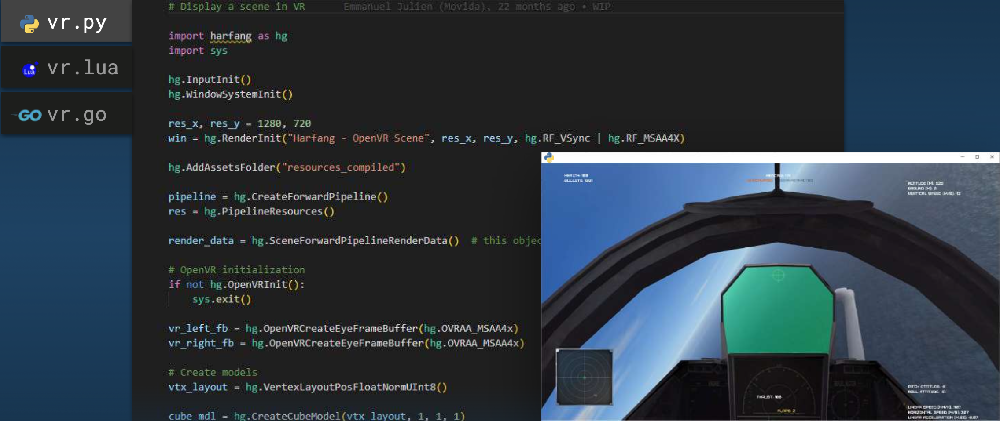
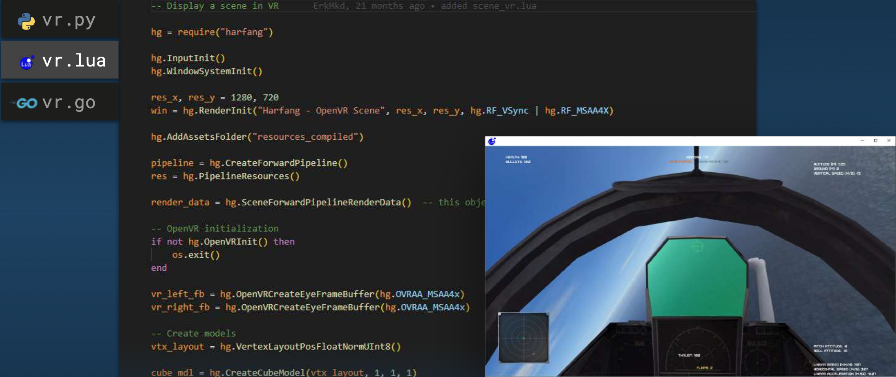
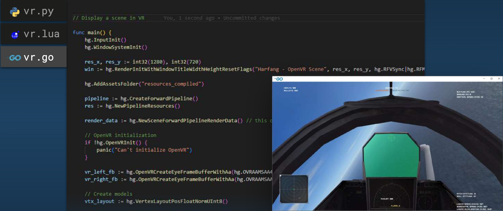

<hr>
<p  align="center"  style="font-weight: bold; font-size: 21px"> ALGOSUP Binding Project </p>

<p  align="center"  style="font-weight: bold; font-size: 18px"> Technical Specification</p>

<br>

<p  align="center"> Clémentine Curel</p>  

<br>

<p  align="center"> ALGOSUP, Group 5. All Rights Reserved. </p>

<hr>

# Summary

<details>

<summary>Table of content</summary>

- [Summary](#summary)
- [Introduction](#introduction)
	- [Overview](#overview)
	- [Context](#context)
	- [Technical requirements](#technical-requirements)
	- [Non-goals](#non-goals)
	- [Assumptions](#assumptions)
- [Solution](#solution)
	- [Current solution](#current-solution)
	- [Proposed solution](#proposed-solution)
	- [Test plan](#test-plan)
- [Further considerations](#further-considerations)
    - [Impact on other teams](#impact-on-other-teams)
    - [Cost analysis](#cost-analysis)
    - [Security](#security)
    - [Privacy](#privacy)
    - [Accessibility](#accessibility)
    - [Risks](#risks)
- [Success evaluation](#success-evaluation)
- [Work](#Work)
    - [Work estimate and timelines](#work-estimate-and-timelines)
    - [Prioritisation](#prioritisation)
    - [Milestones](#milestones)
    - [Future work](#future-work)
- [Deliberation](#deliberation)
    - [Discussion](#discussion)
    - [Open questions](#open-questions)
- [End matter](#end-matter)
    - [References](#references)
    - [Acknowledgements](#acknowledgements)
- [Footnotes](#footnotes)

</details>

<br>


# Introduction

## Overview

The ALGOSUP binding is a project asked by the company Harfang3D[^harfang].

This project aims to improve the FABGen[^fabgen] tool by adding the Rust bindings[^binding].
In simple words, it will be a translation of your code to another language.

This project is due on the 17th of February, 2023.

## Context


FABGen[^fabgen] was written for the Harfang 3D[^harfang] project to bring the C++ engine to languages such as Python, Lua and Go. It was written as a replacement for SWIG[^swig], a well-known binding generator[^gene] supporting many target languages.

The goals of FABGen are: 

- Bidirectional binding. Bind C++ functions to the target language and target language functions to C++.

- Provide an API for embedding (runtime C type name to target name query, human-readable type conversion functions, etc.).

- Full feature support for all target languages unless technically impossible in which case a sensible fallback should be provided.

- Provide fast binding.

These past years, Rust[^rust] has become one of the most loved programming languages, according to [StackOverflow surveys](https://insights.stackoverflow.com/survey/2020#technology-most-loved-dreaded-and-wanted-languages-loved). This is why it would be interesting for FABGen to have the Rust's bindings.


## Technical requirements

You must know C++, the target language Rust, and its feature set. A deep understanding of those features and inner workings is required to come up with a correct solution. 

Taking any shortcut is a guaranteed core dump or memory leak on the user side at a later point.

## Non-goals

At the moment, adding bindings for another language than Rust is not part of the project.

Converting Rust keywords to C and reverse is a step that is not in the Minimum viable product[^mvp].

## Assumptions

Conditions and resources need to be present and accessible for the solution to work as described.

You need to generate a code without dependencies and it has to be human-readable.
- Generator input is a Python script.
- Customisable type conversion from C++ and back.
- Can bind many C++ constructs (function/data members, static function/data members, exceptions, etc.).
- User-specifiable bound name.
- Types can be hidden from the generated binding interface.
- Feature mechanism to extend types and prototypes such as:
	-  `arg_out`, `arg_in_out` to support output arguments.
	-  `route` to route methods to a customisable expression.
	-  `proxy` to support wrapper types such as std::shared_ptr<T>.
- Extern type support to "link" C++ types shared by different bindings.
- Simple and hopefully easy to dive into the codebase.

The solution has to be available for Windows, Linux, and macOS.

# Solution

## Current solution

For the past years, Harfang3D used to work with SWIG, but they had issues like:

-   Very old and complex codebase. Language support is written partially in C and SWIG interface files which are almost a language by themselves. The C codebase does everything through a single Object struct hiding the real type of variables making it extremely difficult to debug and extend the SWIG core.
-   Uneven feature support between languages with missing features although the target language could support them.

So they decided to develop FABGen to solve these issues by:

-   Using Python to implement FABGen and the binding definitions themselves.
-   Implementing as much as possible of the features in a common part of the program (gen.py).

Now, the problem is the number of languages supported (only three):

-   Python 3.2+ (CPython),
-   Lua 5.3+,
-   Go 1.11+.

## Proposed solution

The proposed solution is to add more languages, starting with Rust.

-   Rust:
    -   Compiled,
    -   Statically typed,
    -   Link to C library (C++ has to be wrapped with C first).

This solution will be added to the existing code of the [FABGen repository](https://github.com/ejulien/FABGen).

We recommend using Docker[^docker] to avoid problems during development. It will emulate an os, which is interesting because the team use Mac M1.

A compiled statically typed language will almost always support a mechanism to import and call functions from a C-style ABI. Most of the time this will be the only way to call into a different language and the only to write extensions using native code for the target language.

Adding support for such a language in Fabgen can be done using the following strategy:

### 1. Create a mapping of elementary types

Identify the elementary types common to both languages and create a mapping between them. C types might map to a single or more types in the Rust language.

### 2. Implement a C API wrapping the C/C++ objects

Create functions to access object members of the elementary type. Implement a mechanism to access nested objects.

Note that passing C/C++ objects will be done through the use of naked pointers, the target language will however not be able to differentiate object A from object B (as both essentially are void *) so wrapped objects need to include a type tag to catch programming errors such as passing an object of type A to a function expecting an object of type B.

<br>

This can be done by using a structure like the following:

``` C
struct wrapped_native_obj {
	uint32_t type_tag;
	void *obj;
};
```  

The ownership of a wrapped object needs to be stored as well to properly handle object destruction. Consider the following scenario:

``` C
struct Vec3 {
	float x, y, z;
};

const Vec3 *get_global_vec3();

Vec3 new_vec3(float  x, float  y, float  z);
```

The `get_global_vec3` function returns a pointer to a Vec3 that is owned by the native layer, ownership is not passed to the target language. For small objects it might be justified to force a copy of the returned object to address potential issues with the object's lifetime, the target language gets ownership of the returned object. But some native types might be too expensive to copy or might simply be non-copyable.

All sorts of strategies can be devised to address complex lifetime issues like the one presented here. But selecting the best one to use depends on the native library being wrapped and the target language.

### 3. Better integration with the target language

While the wrapped API can technically do everything we need to use the native library its usage will feel completely foreign to the target language. Using the wrapped API directly, let's consider the following sequence of instructions to add two vectors in Python. It might look like this:

```python
a = vec3_new(2, 4, 8)
b = vec3_new(1, 3, 4)
c = vec3_add(a, b)

print(f'x: {vec3_get_x(c)} y: {vec3_get_y(c)} z: {vec3_get_z(c)}')

vec3_delete(a)

vec3_delete(b)

vec3_delete(c)
```

While functional, this code is as far as idiomatic Python as it can be:

- It performs manual memory management
- Objects are accessed through global functions
- Operators are replaced by global function calls

 Idiomatic Python might look more like this:

```python
a = vec3(2, 4, 8)
b = vec3(1, 3, 4)

c = a + b

print(f'x: {c.x} y: {c.y} z: {c.z}')

```

Achieving this degree of integration of the native API types with CPython requires the use of PyTypeObject which is exactly what Fabgen does to implement support for operator overload and automatic memory management of native objects.


## Test plan

// to do a link to the test plan.

[Test plan](#)

# Further considerations

- Keep as much code as possible on the generic part of the generator ([gen.py](https://github.com/algosup/2022-2023-project-3-harfang3d-binding-Project-5-group/blob/main/gen.py)).

- Any feature that can be done using what's available should be culled (aka. no feature creep).

- Output library must feel as native as possible to the target language.


## Impact on other teams

For Rust programmers will be allowed to use Harfang3D in Rust, it will be a gain of time.
For Harfang3D, it will bring new users.


## Cost analysis

For this project, there is no need for any additional software or hardware that could cost money.

## Security

This solution has to not affect the security of other services, and systems.

## Privacy

Fabgen is licensed under the GPLv3[^gpl].

**Fabgen output does not fall under the GPLv3, you are free to license it as you please.**


## Accessibility

In the early days, this solution will be accessible on this GitHub repository. 
If this project is accepted by FABGen, it will be accessible on their GitHub, after deeper verifications.

## Risks

Doing this type of project, we can have multiple problems like:

-  Low customer satisfaction or unpredictable requirements changes => Be sure of what the customer wants by making him validate the functional specification.
-  Not working software, or security issues => Write a test plan and test everything.
-  Delay => Follow the forecast planning and respect deadlines.
- Needs to use dependencies => Not implementing the feature and asking the customer about it.


# Success evaluation

The project will be considered as successful when it will generate the API[^api] correctly with Rust code.

Here is an example of the final result in the other languages:

The Python code with the API result:


The Lua code generated by FABGen with the API result:


The Go code generated by FABGen with the API result:


As you can see, The API result is always the same.
So the project will be considered finished when FABGen will generate a Rust code with the same API result.

# Work

## Work estimate and timelines

// to do

-   List of specific, measurable, and time-bound tasks
-   Resources needed to finish each task
-   Time estimates for how long each task needs to be completed
Milestones 
[To-do list (private)](https://github.com/orgs/algosup/projects/5)

## Prioritisation

// to do - Categorisation of tasks by urgency and impact.

## Milestones

// to do - Dated checkpoints when significant chunks of work will have been completed.

// to do - Metrics to indicate the passing of the milestone.

- Documents.
- Fix tests.
- Convert Rust types to C.
- Convert C types to Rust.

## Future work

# Deliberation  

## Discussion

## Open questions

  

# End matter

## References

[Harfang3D](https://www.harfang3d.com/en_US/)

[FABGen GitHub](https://github.com/ejulien/FABGen)

[GitHub project](https://github.com/harfang3d/algosup-binding-project)


## Acknowledgements

[Harfang3D](https://github.com/harfang3d)

[Emmanuel Julien](https://github.com/ejulien)

[François Gutherz](#)

[ALGOSUP](https://github.com/algosup)

[Victor LEROY ](https://github.com/Victor-Leroy) -  Project Manager

[Théo DIANCOURT](https://github.com/TheoDct) - Program Manager

[Clémentine CUREL](https://github.com/Clementine951) - Technical Leader

[Paul MARIS](https://github.com/PaulMarisOUMary) - Software Engineer

[Malo ARCHIMBAUD](https://github.com/algosup/2022-2023-project-3-harfang3d-binding-Project-5-group/commits?author=Malo-Archimbaud) - Quality Assurance

# Footnotes


[^fabgen]: FABGen is a binding generator for C, C++, Pyhton, Lua and Go.

[^binding]: A binding is a way to access a library in a different language than the one it was written in.
 
[^gene]: A binding generator is a tool that generates bindings for a library or program written in one programming language, allowing it to be used from another programming language.

[^harfang]: Harfang 3D is a 3D engine and set of libraries for creating 3D applications, such as games, simulations, and visualizations. It includes support for rendering, animation, physics, audio, and other features common to 3D applications. Harfang 3D is designed to be portable and easily integrable into a variety of platforms and pipelines.

[^swig]: SWIG is a software development tool that connects programs written in C and C++ with a variety of high-level programming languages.

[^rust]: Rust is a statically typed, multi-paradigm programming language that’s focused on safety and performance. Rust was built with safety, speed, and efficiency in mind.

[^api]: Application Programming Interface is a set of definitions and protocols for building and integrating application software.

[^mvp]: A MVP or a Minimum viable product is a development technique in which a new product or website is developed with sufficient features to satisfy early adopters.

[^docker]: Docker is a tool used to run containers. Containers are sort of like virtual machines, which are like simulations of a computer running inside of your real computer.

[^gpl]: GPLV3 is a licence that allows users to use the software for any purpose. Also, to change and share the software with or without changes.